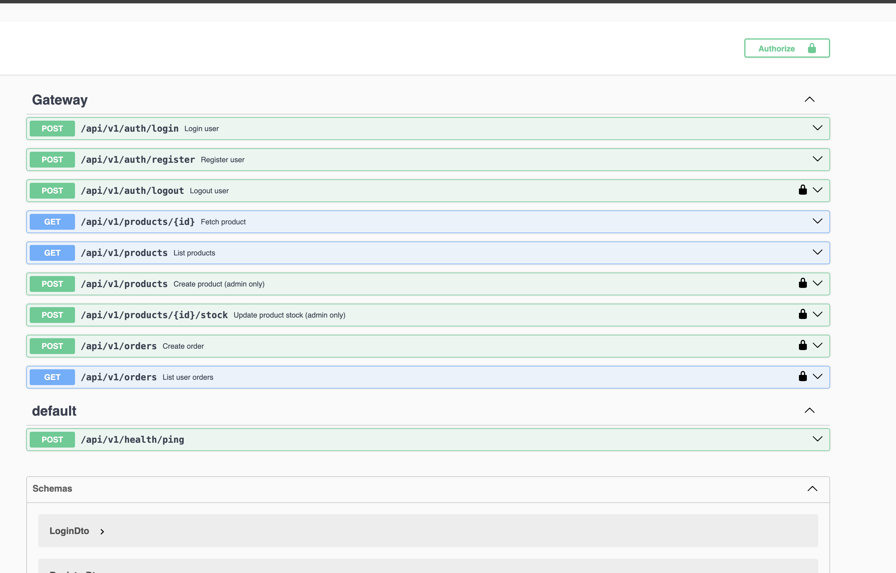

# Vendyz Flash Sale

Microservices-based flash sale system built with NestJS, gRPC, NATS, Postgres, Redis cache, and a Vite + React frontend.

## How to Run

```bash
docker-compose up --build
```

- Gateway: http://localhost:3000
- Swagger: http://localhost:3000/docs
- Frontend: http://localhost:5173

Seeded user (configured via env):
```
AUTH_SEED_EMAIL=lead@vendyz.dev
AUTH_SEED_PASSWORD=flashsale
```

## Screenshots




## Architecture (ADR)

**Database choice:** Postgres
- Strong transactions and row-level locking for inventory safety.

**Race condition handling:** Transaction + row lock
- Reserve stock uses a transaction with a row lock to prevent oversell.
- Ensures only one buyer can decrement the last unit.

**REST vs Event-driven:**
- REST at the Gateway for browser clients.
- gRPC for service-to-service calls (typed, fast, internal).
- NATS for async events (audit, analytics, cache invalidation).
- We keep order creation synchronous to avoid “pending” orders that later fail, which is a poor user experience during flash sales.

**Why gRPC:**
- Strict contracts with proto files; low-latency internal calls under high load.

**Why a Gateway:**
- Single entry point for auth, validation, and response formatting.
- Central place for rate limits, auth, and API documentation.

## Architecture Flow

Text block diagram keeps the flow readable in any terminal/README renderer without extra tools.

```
Client (React)
  |
  v
Gateway (REST + Swagger)
  |  \
  |   \__ Auth Service (gRPC) -> Postgres (auth_db)
  |
  +--> Order Service (gRPC) -> Postgres (order_db)
  |          |
  |          +--> Inventory Service (gRPC) -> Postgres (inventory_db)
  |
  +--> Redis (product cache)
  |
  +--> NATS (events: inventory reserved/created, health pings)
              ^
              |
         Auth/Order/Inventory services publish events
```

Flow summary:
- The client only talks to the Gateway.
- The Gateway calls Auth/Inventory/Order over gRPC.
- Order reserves stock in Inventory (transaction + row lock) before confirming.
- Inventory and Order publish events to NATS; Gateway uses those for cache and health.

Health monitoring:
- Each service publishes a heartbeat to NATS on `health.ping`.
- Gateway tracks last-seen timestamps and pushes status via WebSocket to the UI.

Idempotency:
- `POST /api/v1/orders` accepts `Idempotency-Key` header for safe retries.
- The Order service stores the key and returns the existing order if the same key is replayed.

## Services
- Auth Service (JWT + roles)
- Inventory Service (stock source of truth)
- Order Service (order creation + inventory reservation)
- Gateway Service (REST API + Swagger)
- Frontend (Vite + React)

## Notes
- Inventory is seeded with `product-1` stock `1`.
- Redis is used for product read caching.
- NATS publishes inventory/order events; gateway subscribes for cache updates.
